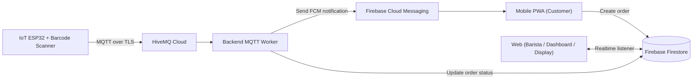

# AQMS CoffeeGold GKUB

Automated Queue Management System (AQMS) untuk Coffee Gold GKUB — sistem end-to-end untuk pemesanan, manajemen antrian, dan notifikasi “order ready” yang terintegrasi dengan Firebase + MQTT + perangkat IoT (ESP32 barcode scanner).

## Ringkasan

- Customer membuat pesanan lewat aplikasi “mobile” (PWA).
- Barista memantau antrian & menyelesaikan pesanan lewat web (barista, dashboard, display).
- Perangkat IoT (ESP32 + scanner) mem-publish event selesai via HiveMQ (MQTT over TLS).
- Backend worker mendengarkan MQTT, mengubah status order di Firestore, dan (opsional) mengirim notifikasi.

## Arsitektur



## Struktur Monorepo

- [apps/backend](apps/backend) — Express + TypeScript (MQTT worker, Firebase Admin)
- [apps/web](apps/web) — Next.js (barista queue, dashboard, display)
- [apps/mobile](apps/mobile) — Next.js (customer ordering PWA)
- [packages/shared](packages/shared) — shared Firebase init + constants
- [iot/firmware](iot/firmware) — PlatformIO (ESP32 firmware)

## Fitur

### Customer App (Mobile)

- Register / login dengan Firebase Auth
- Browse menu & kustomisasi pesanan
- Checkout membuat dokumen order dengan ID format `ORDER-XXXXXXXX` dan `queue_number` harian (transaction-safe)
- Tracking status antrian real-time
- Notifikasi:
  - FCM token disimpan ke koleksi `fcm_tokens/{uid}`
  - (Opsional) Web Push (VAPID) lewat endpoint server

### Barista App (Web)

- Halaman antrian `/barista`: INCOMING (queued/in_progress) dan COMPLETED, real-time
- Halaman statistik `/dashboard`: ringkasan harian, revenue, top menu, chart
- Halaman display `/display`: tampilan antrian untuk layar kasir
- Aksi “mark ready” mengubah status order menjadi `completed`

### Backend (MQTT Worker)

- Subscribe topic HiveMQ Cloud via MQTT over TLS
- Menandai order menjadi `completed` saat menerima event barcode dari IoT
- Fallback: jika tombol fallback ditekan, backend akan menyelesaikan order aktif paling depan (berdasarkan `queue_number`)
- Untuk local dev, MQTT bisa dinonaktifkan (backend tetap jalan) jika env MQTT tidak diisi

### IoT Firmware (ESP32)

- Scan barcode GM65 via UART
- Publish ke MQTT topic `aqms/order/complete`
- OLED SSD1306 128×64 untuk feedback status
- Tombol fallback manual
- Buffer offline (RAM) saat WiFi putus, auto-kirim saat reconnect
- Heartbeat telemetri periodik dan error logging

## Tech Stack

| Layer | Teknologi |
|---|---|
| Mobile & Web | Next.js 15, React 19, Tailwind CSS, TypeScript |
| Backend | Express, TypeScript, Firebase Admin SDK, MQTT.js |
| Database & Auth | Firebase Firestore, Firebase Auth |
| Messaging | MQTT over TLS (HiveMQ Cloud) + FCM |
| IoT | ESP32, PlatformIO, Arduino framework |
| Monorepo | npm workspaces |

## Quick Start (Local Development)

### Prasyarat

- Node.js 18+ (disarankan 20 LTS)
- npm (repo ini menggunakan npm workspaces; lihat [package.json](package.json))
- Firebase project (Firestore + Auth; FCM jika ingin push)
- (Opsional) HiveMQ Cloud account + credentials
- (Opsional) PlatformIO (untuk firmware ESP32)

### Install dependencies

Jalankan dari root repo:

```bash
npm install
```

### Jalankan aplikasi

Jalankan masing-masing di terminal terpisah:

```bash
npm run dev:backend
```

```bash
npm run dev:web
```

```bash
npm --workspace @aqms/mobile run dev
```

Default port:

- Backend: `http://localhost:4000/health`
- Web: `http://localhost:3000`
- Mobile: `http://localhost:3001`

## Konfigurasi (Environment Variables)

### Backend

Backend membutuhkan Firebase Admin service account.

Required:

- `FIREBASE_PROJECT_ID`
- `FIREBASE_CLIENT_EMAIL`
- `FIREBASE_PRIVATE_KEY` (simpan dengan `\n` literal, backend akan mengubahnya menjadi newline)

Optional:

- `PORT` (default `4000`)
- `MQTT_HOST` (jika kosong → MQTT subscriber dinonaktifkan)
- `MQTT_PORT` (default `8883`)
- `MQTT_USERNAME`
- `MQTT_PASSWORD`
- `MQTT_CLIENT_ID`

### Web (Barista/Dashboard/Display)

Firebase client config:

- `NEXT_PUBLIC_FIREBASE_API_KEY`
- `NEXT_PUBLIC_FIREBASE_AUTH_DOMAIN`
- `NEXT_PUBLIC_FIREBASE_PROJECT_ID`
- `NEXT_PUBLIC_FIREBASE_STORAGE_BUCKET`
- `NEXT_PUBLIC_FIREBASE_MESSAGING_SENDER_ID`
- `NEXT_PUBLIC_FIREBASE_APP_ID`

Push (FCM) untuk web (opsional):

- `NEXT_PUBLIC_FIREBASE_VAPID_KEY`

Jika memakai Web Push yang dipicu dari web (memanggil endpoint di mobile):

- `NEXT_PUBLIC_MOBILE_APP_URL` (default `http://localhost:3001`)

### Mobile (Customer PWA)

Firebase client config (sama seperti web):

- `NEXT_PUBLIC_FIREBASE_API_KEY`
- `NEXT_PUBLIC_FIREBASE_AUTH_DOMAIN`
- `NEXT_PUBLIC_FIREBASE_PROJECT_ID`
- `NEXT_PUBLIC_FIREBASE_STORAGE_BUCKET`
- `NEXT_PUBLIC_FIREBASE_MESSAGING_SENDER_ID`
- `NEXT_PUBLIC_FIREBASE_APP_ID`
- `NEXT_PUBLIC_FIREBASE_VAPID_KEY` (untuk FCM token)

Web Push (VAPID) endpoint (opsional, dipakai oleh `/api/send-push`):

- `NEXT_PUBLIC_VAPID_PUBLIC_KEY`
- `VAPID_PRIVATE_KEY`
- `VAPID_SUBJECT`

Jika ingin endpoint `/api/send-push` bisa membaca Firestore via Firebase Admin:

- `FIREBASE_ADMIN_PROJECT_ID`
- `FIREBASE_ADMIN_CLIENT_EMAIL`
- `FIREBASE_ADMIN_PRIVATE_KEY` (gunakan `\n` literal)

## Model Data (Firestore)

Koleksi/dokumen yang digunakan (ringkas):

- `orders/{ORDER-XXXXXXXX}`: data order + `queue_number`, `status`, `created_at`, `completed_at`
- `counters/daily_queue`: counter harian untuk `queue_number` (reset per tanggal)
- `fcm_tokens/{uid}`: token FCM user
- `users/{uid}`: (opsional) `pushSubscription` untuk Web Push (VAPID)
- `baristas/{uid}`: (opsional) metadata barista

Catatan: beberapa query memakai kombinasi `where` + `orderBy` sehingga Firestore mungkin meminta pembuatan index komposit.

## MQTT Topics & Payload

Topic yang digunakan:

- `aqms/order/complete` → payload JSON: `{ "order_id": "ORDER-12345678" }`
- `aqms/order/fallback` → payload JSON: `{}`
- `aqms/device/status` → telemetri (contoh): `{ "rssi": -55, "ram": 123456, "mqtt": true }`
- `aqms/device/error` → error log (contoh): `{ "type": "scan_error", "msg": "invalid_format" }`

Backend hanya menerima format order ID `ORDER-########` (8 digit).

## IoT Firmware

- Project PlatformIO ada di [iot/firmware](iot/firmware)
- Konfigurasi WiFi + MQTT ada di [iot/firmware/include/config.h](iot/firmware/include/config.h)

Build/Upload (contoh menggunakan CLI PlatformIO):

```bash
pio run
pio run -t upload
pio device monitor -b 115200
```

## Security Notes

- Jangan commit kredensial asli (WiFi password, MQTT password, private key service account) ke repo publik.
- Jika kredensial pernah ter-commit, anggap bocor dan lakukan rotasi (Firebase service account / HiveMQ credentials).

## Scripts

Lihat root scripts di [package.json](package.json):

- `npm run dev:backend`
- `npm run dev:web`
- `npm run build`
- `npm run lint`

## Tim Pengembang

| No | Nama | NIM |
|---|---|---|
| 1 | Naura Ayurachmani | 18223061 |
| 2 | Sendi Putra Alicia | 18223063 |
| 3 | Catherine Alicia N | 18223069 |
| 4 | Noeriza Aqila Wibawa | 18223095 |
| 5 | Audy Alicia Renata Tirayoh | 18223097 |
